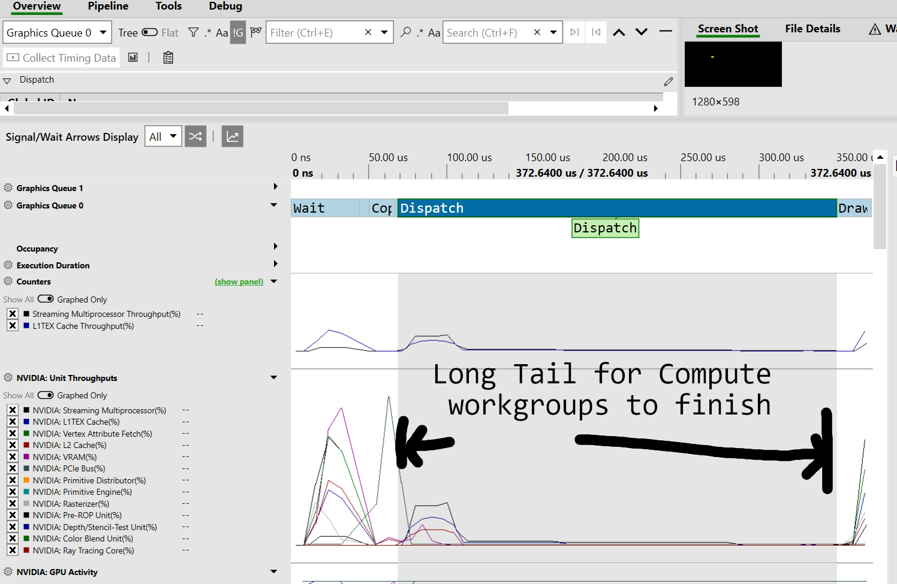

Someone on the chrome team pointed me to this:

You can use [PIX](https://devblogs.microsoft.com/pix/download/) to debug WebGPU on Windows. Here are some instructions for using it with Chrome: [https://gist.github.com/Popov72/41f71cbf8d55f2cb8cae93f439eee347](https://gist.github.com/Popov72/41f71cbf8d55f2cb8cae93f439eee347)

Example screenshot:

